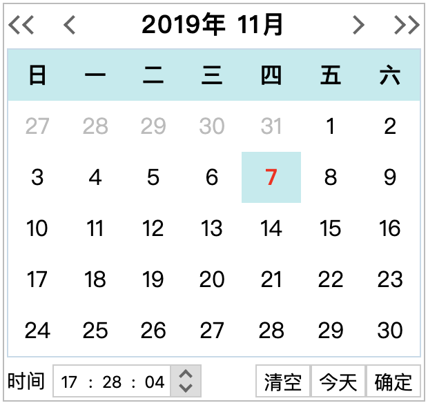

# DatePicker

>一个包含日期和时间的纯JS日期控件，不依赖任何库或框架，方便与其他库集成。使用方式极其简单，只需要导入 lib/DatePicker.min.js ，然后在页面添加 `<input type="DatePicker">` 即可。



## 一般使用

``` html
<script type="text/javascript" src="../lib/DatePicker.min.js"></script>

<input type="DatePicker">
```

## 配合Vue使用

``` html
<div id="app">
    <input type="DatePicker" v-model="myDate">
    <span>输入的日期是：{{myDate}}</span>
</div>

<script type="text/javascript" src="../lib/DatePicker.min.js"></script>
<script>
    const app = new Vue({
        el: '#app',
        data: {
            myDate: ''
        }
    });
    window.app = app;
</script>
```